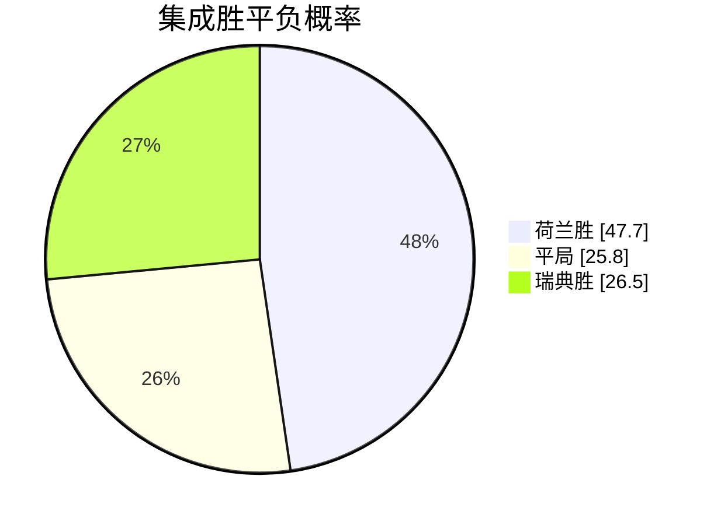
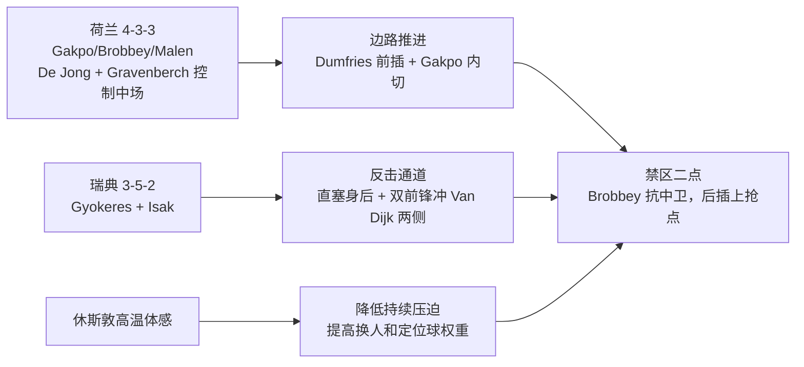

# 2026 世界杯 F 组：荷兰 vs 瑞典比分预测研究报告

生成时间：2026-06-21 01:03 北京时间  
比赛：荷兰 vs 瑞典，世界杯 F 组 Match 35  
定位：赛前/刚开球窗口预测；未抓到可验证赛中进球事件  
结论：首选比分 **荷兰 2-1 瑞典**，次选 **1-1**，冷门防线 **1-2**

> 说明：本报告为研究与娱乐参考，不是投注建议。实时比分、伤停和盘口会快速变化。

## 一、核心结论

| 项目 | 判断 |
| --- | --- |
| 90 分钟倾向 | 荷兰小优，但不是稳胆 |
| 集成概率 | 荷兰胜 47.7%，平 25.8%，瑞典胜 26.5% |
| 预测比分 | 荷兰 2-1 瑞典 |
| 半场倾向 | 1-0 或 1-1 |
| 总进球 | 2-3 球为主，双方进球概率偏高 |
| 风险等级 | 中高：瑞典双前锋状态强，平局权重不能忽略 |

## 二、信息源与安装的预测 skills

已从 GitHub 下载/安装两个世界杯预测相关 skills：

| Skill | 本地路径 | 用途 |
| --- | --- | --- |
| `world-cup-predictor` | `C:\Users\ZhuanZ\.codex\skills\world-cup-predictor` | 实时研究流程：新闻、天气、市场、阵容、战术证据 |
| `worldcup-predictor-skill` | `C:\Users\ZhuanZ\.codex\skills\worldcup-predictor-skill` | 离线审计快照 + 泊松 / Dixon-Coles 比分分布 |

本次自建研究快照：`C:\Users\ZhuanZ\Documents\世界杯\nl_sweden_research_snapshot.json`

主要公开来源：

| 来源 | 提取信息 |
| --- | --- |
| [FIFA Match Centre](https://www.fifa.com/en/match-centre/match/17/285023/289273/400021472) | Match 35，F 组，Houston Stadium，2026-06-20 17:00 UTC |
| [咪咕视频 App Store 赛事页](https://apps.apple.com/mg/app/%E5%92%AA%E5%92%95%E8%A7%86%E9%A2%91-%E7%9C%8B%E4%BA%9A%E6%B4%AF%E8%B6%B3%E7%90%83%E7%9B%B4%E6%92%AD/id787130974?eventid=6780369613) | “世界杯小组赛：荷兰VS瑞典”国内直播/赛事入口 |
| [FOX Sports 比赛页](https://www.foxsports.com/soccer/fifa-world-cup-men-netherlands-vs-sweden-jun-20-2026-game-boxscore-647648) | 首发阵型、球员、首轮统计、赔率、休斯敦天气 |
| [LiveScore 中文页](https://www.livescore.com/zh/zuqiu/guo-ji/world-cup-2026/netherlands-vs-sweden/1417942/) | 赛程、裁判 Michael Oliver、场地 NRG Stadium |
| [新华网首轮报道](https://www.xinhuanet.com/sports/20260615/ea16023da9fb47bebd213e596820e39c/c.html) | F 组首轮：荷兰 2-2 日本，瑞典 5-1 突尼斯 |
| [Climate Central match heat page](https://www.climatecentral.org/world-cup-2026/matches/35) | 休斯敦高温对比赛强度的潜在影响 |
| [GitHub: qqyule/worldcup-predictor-skill](https://github.com/qqyule/worldcup-predictor-skill) | 本地离线预测引擎来源 |
| [GitHub: agentara/skills](https://github.com/agentara/skills) | `world-cup-predictor` 研究型 skill 来源 |

## 三、当前赛事实况核验

截至 2026-06-21 01:03 北京时间，我重新打开 FOX、ESPN、LiveScore 等页面，没有抓到可验证的赛中比分或进球事件。FOX 页面仍显示首发、赔率、天气和预览信息；LiveScore 页面显示赛事信息、裁判和场地。因此本报告按“赛前/刚开球窗口”预测处理。

## 四、基本面摘要

| 维度 | 荷兰 | 瑞典 | 解读 |
| --- | --- | --- | --- |
| 首轮结果 | 2-2 日本 | 5-1 突尼斯 | 瑞典势头更热，荷兰有领先后被追平的隐患 |
| FOX 首轮 xG | 1.1 | 1.5 | 瑞典进攻效率和质量都更亮眼 |
| FOX 首轮射门 | 11 | 13 | 瑞典创造量略高 |
| FOX 控球率 | 67% | 54% | 荷兰更像控球压制方 |
| 阵型 | 4-3-3 | 3-5-2 | 荷兰边路宽度 vs 瑞典双前锋反击 |
| 市场 | 荷兰 -149，瑞典 +379 | 大小球 2.5，大球 -162 | 市场给荷兰优势，同时预期进球不低 |
| 天气 | 休斯敦 88°F，体感 100°F | 同场 | 高热高湿削弱持续高压，利于节奏分段 |

## 五、战术图

关键对位：

| 对位 | 倾向 |
| --- | --- |
| De Jong / Gravenberch 对瑞典三中场 | 荷兰能拿到更多控球，但需要防丢球后的第一传 |
| Van Dijk / Van Hecke 对 Gyokeres / Isak | 全场最大变量；瑞典两名前锋足以把低控球转化为高威胁 |
| Dumfries 右路前插 | 荷兰进球来源之一，也会留下身后空间 |
| 定位球 | 瑞典三中卫和双前锋提高定位球威胁，荷兰也有 Van Dijk 高点 |

## 六、模型与盘口交叉校验

### 1. 市场归一化

使用 FOX 显示的荷兰 -149、瑞典 +379，并用公开赛前常见平局价约 4.10 做三项归一化：

| 结果 | 归一化概率 |
| --- | ---: |
| 荷兰胜 | 56.9% |
| 平局 | 23.2% |
| 瑞典胜 | 19.9% |

### 2. 本地 skill 输出

`worldcup-predictor-skill` 在去除“瑞典 5-1 单场进球过拟合”后输出：

| 结果 | 概率 |
| --- | ---: |
| 荷兰胜 | 30.8% |
| 平局 | 31.3% |
| 瑞典胜 | 37.9% |

这个结果明显比盘口更看好瑞典，原因是离线模型把瑞典首轮 xG、状态和双前锋形态给了较高权重。它提醒我们：荷兰不是无风险热门。

### 3. 最终集成

权重：市场 45%，结构模型 25%，战术人工层 30%。

```mermaid
xychart-beta
  title "三类信号对比"
  x-axis ["荷兰胜", "平局", "瑞典胜"]
  y-axis "概率 %" 0 --> 60
  bar [56.9, 23.2, 19.9]
  bar [30.8, 31.3, 37.9]
  bar [47.7, 25.8, 26.5]
```

## 七、比分分布

用集成判断校准的进球均值：荷兰 1.65，瑞典 1.15。

| 排名 | 比分 | 概率 |
| ---: | --- | ---: |
| 1 | 1-1 | 11.6% |
| 2 | 1-0 | 10.1% |
| 3 | 2-1 | 9.5% |
| 4 | 2-0 | 8.3% |
| 5 | 0-1 | 7.0% |
| 6 | 1-2 | 6.7% |
| 7 | 0-0 | 6.1% |
| 8 | 2-2 | 5.5% |

虽然单一最高比分是 1-1，但胜负方向、赔率和荷兰控球/阵容深度综合后，我把最终比分定为 **荷兰 2-1 瑞典**。

## 八、模拟进程

| 时间段 | 比赛画面 |
| --- | --- |
| 0-15 分钟 | 荷兰控球更高，瑞典不急于压上，优先保护中路 |
| 16-30 分钟 | 荷兰右路和左肋开始形成传中/倒三角，瑞典靠双前锋制造第一次高质量反击 |
| 31-45+ 分钟 | 荷兰更可能先得分；若瑞典得到定位球，半场 1-1 风险显著上升 |
| 46-60 分钟 | 高温下两队节奏下降，荷兰控球转为更耐心，瑞典等待身后球 |
| 61-75 分钟 | 换人窗口决定比赛：Depay、Summerville、Weghorst 这类替补改变荷兰禁区占领 |
| 76-90+ 分钟 | 瑞典若落后会提高边翼卫站位；荷兰可能通过反击或二点球打入制胜球 |

预测进球路径：

| 分钟 | 事件 |
| --- | --- |
| 24-36 | 荷兰边路推进制造禁区内射门，1-0 |
| 48-62 | 瑞典双前锋反击或定位球追平，1-1 |
| 72-84 | 荷兰替补/边路二次进攻完成 2-1 |

## 九、反方风险

1. 瑞典不是传统弱队形态：3-5-2 的双中锋组合可以直接打穿荷兰边后卫身后。
2. 荷兰首轮两次领先仍被日本追成 2-2，说明比赛管理和末段防守还没完全稳定。
3. 休斯敦体感高温会削弱荷兰连续压迫，增加定位球和偶发失误的权重。
4. 如果瑞典先进球，比赛会立刻变成荷兰围攻，1-1 或 1-2 的概率会上升。

## 十、最终判断

**推荐预测：荷兰 2-1 瑞典。**

分层判断：

| 市场 | 判断 |
| --- | --- |
| 胜平负 | 荷兰不败优先，主胜略优于平 |
| 比分 | 2-1 首选，1-1 次选，1-2 防冷 |
| 总进球 | 2-3 球；大 2.5 有逻辑但受高温节奏影响 |
| 双方进球 | 倾向是 |

一句话版本：荷兰整体实力和盘口仍在前面，但瑞典的双前锋与首轮状态足够制造进球；最合理的剧本是荷兰控球优势转化为 2-1，小心 1-1。
